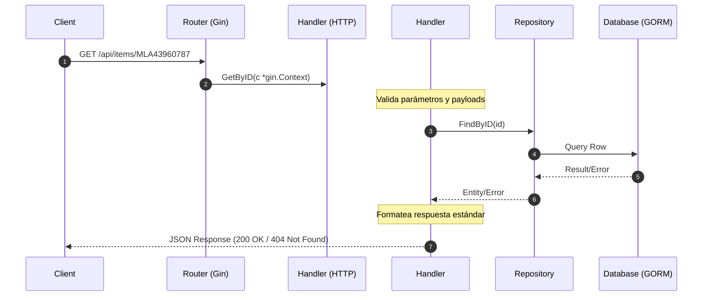

# Lineamientos y Arquitectura de Microservicios en Go

Este documento detalla los principios de diseño, la estructura de carpetas y los estándares de desarrollo que siguen los servicios en Go (`items-service`, `orders-service` y futuros servicios) en esta plataforma de simulador de Mercado Libre.

---

## 1. Principios de Arquitectura

El diseño sigue una combinación de **Clean Architecture** (Arquitectura Limpia) y principios de **DDD (Domain-Driven Design)** simplificados para asegurar modularidad, desacoplamiento de dependencias y facilidad para escalar.

### Capas y Límites de Dependencia
El código se organiza en capas de adentro hacia afuera. Las dependencias solo pueden apuntar hacia adentro:
1.  **Dominio (Entidades y Reglas de Negocio):** Representado por las entidades (ej. `Item`, `Order`) y interfaces de repositorio. No depende de ningún framework ni librería externa (excepto las etiquetas de serialización y ORM directo).
2.  **Casos de Uso / Adaptadores (Repository & Handlers):** La lógica de cómo se recuperan los datos, cómo se manipulan transaccionalmente y cómo se procesan las peticiones HTTP (mediante controladores en Gin).
3.  **Frameworks y Drivers (Router & Database GORM):** La infraestructura externa. Base de datos PostgreSQL, enrutador HTTP Gin y librerías externas de red.

### Inyección de Dependencias
Se debe utilizar el patrón de **Manual Dependency Injection (Pure DI)** para instanciar las capas de la aplicación.
*   No debe realizarse el ensamblaje de dependencias (repositorios, handlers, etc.) directamente en `cmd/api/main.go`.
*   Toda la inicialización debe ser extraída a una función contenedor, típicamente en `internal/bootstrap/di.go` (ej. `InitApp(db *gorm.DB)`), la cual retorna el servidor HTTP o router listo para correr. Esto mantiene el `main` limpio y preparado para escalar a múltiples dominios sin fricción.

---

## 2. Estructura de Directorio Estándar

Cada microservicio sigue estrictamente esta estructura de archivos:

```text
├── cmd/
│   └── api/
│       └── main.go       # Punto de entrada y orquestador del servicio
├── internal/
│   ├── api/
│   │   └── router.go     # Configuración de Gin, middlewares y registro de rutas
│   ├── database/
│   │   └── db.go         # Conexión con GORM y configuración de base de datos
│   └── [domain]/         # Carpeta por cada dominio de negocio (ej: item, order)
│       ├── model.go      # Estructuras de dominio de GORM (Entidades)
│       ├── repo.go       # Acceso a base de datos (Interfaces y GORM repos)
│       └── handler.go    # Controladores HTTP (Input/Output HTTP, bindings)
└── pkg/
    └── web/
        └── response.go   # Utilidades HTTP genéricas y formatos estándar de JSON
```

### Descripción de Componentes:
*   **`cmd/api/main.go`**: Carga configuraciones de entorno, inicializa la conexión principal a la base de datos, ejecuta el contenedor de dependencias (`bootstrap.InitApp`) y arranca el servidor HTTP escuchando señales de detención para un **Graceful Shutdown** (apagado ordenado).
*   **`internal/bootstrap/di.go`**: El contenedor de Inyección de Dependencias manual. Conecta la base de datos con los repositorios, los repositorios con los handlers, y finalmente registra todas las rutas HTTP en el router.
*   **`internal/database/db.go`**: Establece la conexión del pool a Postgres. Centraliza valores por defecto y maneja errores de inicialización. **REGLA ESTRICTA**: Está prohibido dejar contraseñas "harcodeadas" como fallbacks en el código (ej. `getEnv("DB_PASSWORD", "postgrespassword")` está mal, debe ser `getEnv("DB_PASSWORD", "")`). Si falta el secreto, la base de datos debe rechazar la conexión.
*   **`internal/[domain]/model.go`**: Declara la estructura del modelo SQL compatible con GORM y los formatos de serialización JSON.
*   **`internal/[domain]/repo.go`**: Implementa la interfaz del repositorio. Todas las operaciones de escritura que requieran atomicidad (como reducir stock) deben implementarse mediante transacciones nativas de GORM (`db.Transaction`) con bloqueos de fila (`FOR UPDATE`).
*   **`internal/[domain]/handler.go`**: Valida los datos entrantes del request utilizando el binding estructurado de Gin (`ShouldBindJSON`), delega la acción al repositorio y mapea la respuesta o el error usando las utilidades de `pkg/web`.
*   **`pkg/web/response.go`**: Mantiene un esquema JSON uniforme para todo el sistema:
    *   **Éxito:** `{"status": "success", "data": {...}, "message": "..."}`
    *   **Fallo:** `{"status": "error", "message": "..."}`

---

## 3. Flujo de Datos en una Solicitud



---

## 4. Lineamientos de Desarrollo (Best Practices)

### A. Coherencia en Enrutamiento dentro de una VPC
Para facilitar el enrutamiento a nivel de Gateway (ALB, Nginx) mediante reglas basadas en paths, **todos los paths del servicio deben agruparse bajo el mismo prefijo del dominio**:
*   *Correcto:* `GET /api/items/:id` y `GET /api/items/health`
*   *Incorrecto:* `GET /items/:id` y `GET /health`

### B. Seguridad en Concurrencia y Transacciones
*   Cuando se realicen operaciones críticas sobre recursos compartidos (como el decremento de stock al comprar), se debe utilizar una transacción y adquirir un bloqueo de fila de base de datos (`FOR UPDATE`) para evitar condiciones de carrera (Race Conditions).

### C. Resiliencia
*   **Graceful Shutdown:** El servicio no debe morir abruptamente al recibir una señal de apagado (`SIGINT`, `SIGTERM`). Se deben tolerar de 5 a 10 segundos para dejar que las peticiones HTTP que ya están en vuelo terminen de procesarse.
*   **Tiempos de espera (Timeouts):** Al consumir APIs de otros microservicios (como de `orders-service` a `items-service`), se debe utilizar un cliente HTTP con un timeout explícito de máximo 5 segundos para evitar colgar hilos indefinidamente si el otro servicio está offline.

### D. Migraciones e Inicialización de Datos
*   No se debe utilizar `db.AutoMigrate` en servicios de producción para mutar esquemas de bases de datos desde el código Go.
*   La lógica de creación de tablas (`CREATE TABLE IF NOT EXISTS`) y sembrado de datos iniciales (`INSERT ... ON CONFLICT DO NOTHING`) debe delegarse al ecosistema Docker, usando scripts `.sql` dentro del directorio `docker-entrypoint-initdb.d` de la imagen de Postgres. El código en Go debe permanecer 100% agnóstico respecto a la administración del esquema de la base de datos.

### E. Idioma del Código
*   Todo el código, variables, nombres de funciones, comentarios en el código, docstrings y mensajes de *logging* estructurado (`slog`) deben escribirse estrictamente en **Inglés**. La documentación externa y archivos como este pueden estar en Español si el equipo lo prefiere, pero el código fuente es territorio en inglés.
